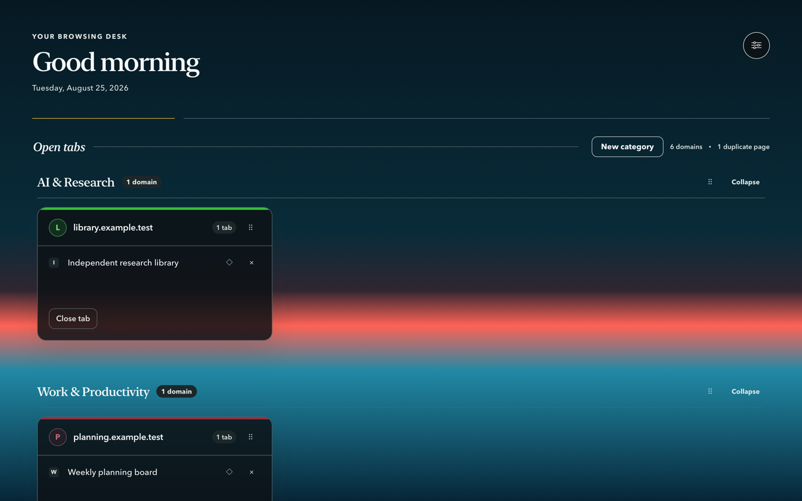
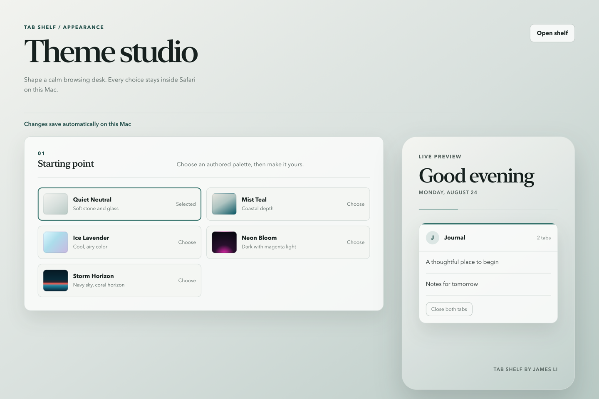
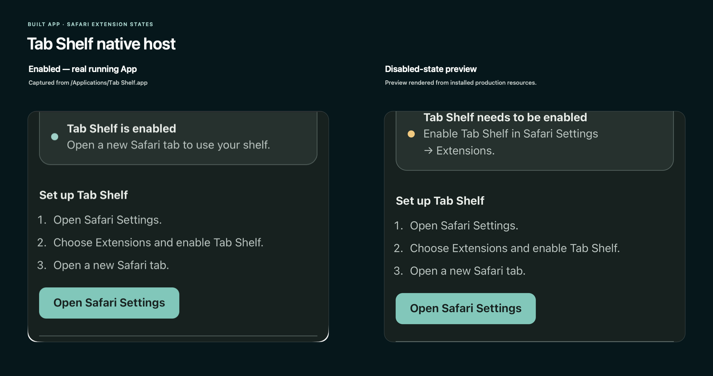

# Tab Shelf

> A calm, private visual shelf for the Safari tabs open on your Mac.

## Why Tab Shelf

Tab Shelf is a Safari-only personal utility that turns the tabs open on the current Mac into a focused visual workspace. It groups ordinary web tabs into automatic local categories, keeps one card per domain, makes duplicates easy to spot, and keeps cleanup and appearance controls close at hand.

It is designed for people who want a quieter way to review many Safari tabs without creating an account or sending browsing data to a service.

## See it in action

Open a new Safari tab to see useful local categories with one consistent card per domain. Each card shows its open pages, a locally derived accent, and direct controls to activate or close tabs. Dedicated drag handles and equivalent keyboard move menus let you arrange the workspace without changing Safari's native tab order. The toolbar popover provides the current web-tab count and a quick route to the shelf and Theme Studio.



Theme Studio exposes five authored starting points and local appearance controls. The native macOS host explains whether Safari has enabled the extension without sending account or browsing data anywhere.

| Theme Studio | Native host states |
| --- | --- |
|  |  |

These images use representative synthetic tabs and the locally built Tab Shelf UI. They contain no placeholder store artwork, stock media, watermark, or private browsing data.

## Choose your install path

Both install paths provide the same core features. The difference is how Tab Shelf is installed, signed, and updated.

### Build from source — Free

Use the public Apache-2.0 source with Safari's developer workflow. This path is free and intended for people comfortable enabling Safari developer features, running the repository checks, and managing their own local build or temporary installation.

### Mac App Store — USD 9.99 one time

The Mac App Store edition has the same core features with Apple-reviewed installation, signing, and updates. The price is a one-time USD 9.99 purchase.

No ads, subscriptions, accounts, analytics, or telemetry are included in either edition.

**Mac App Store release in preparation.** There is no public store listing yet, so this README does not link to or display a store badge.

## Features

- Automatic local categories with one consistent card per domain in responsive category lanes.
- Dedicated drag handles for reordering categories, reordering cards, and moving a domain into another category.
- Keyboard move menus that provide the same organization controls without dragging.
- Up to 24 custom categories, with names from 1 to 40 characters, plus rename, collapse, and safe delete controls.
- Persistent manual assignments and ordering stored only on the current Mac.
- A distinct card accent per domain, derived locally from an available favicon with a stable privacy-safe fallback.
- Full tab titles with safe two-line truncation and tooltips.
- Activate a tab, close one tab, close a domain, or close extra shelf pages.
- Toolbar badge and popover for the current web-tab count.
- Five authored themes: Quiet Neutral, Mist Teal, Ice Lavender, Neon Bloom, and Storm Horizon.
- Custom solid, linear-gradient, radial-gradient, and local-image backgrounds.
- Adjustable image fit, blur, image opacity, overlay, card opacity, text mode, contrast, and accent color.
- Local theme export and import through `tab-shelf-preferences-v1.json`.
- An editorial system-font pairing with readable multilingual tab titles.
- Keyboard focus, reduced-motion support, semantic HTML, and responsive layouts.

## Organize your workspace

Tab Shelf starts with deterministic categories such as Work & Career, AI & Research, Communication, Shopping, and Other. Classification is local and repeatable. A manual move becomes a permanent assignment and takes priority over the automatic rule for that domain.

Use the grip on a category or card to drag it into place. The adjacent move menu exposes the same actions for keyboard and assistive-technology users. Custom categories can be created from the shelf, renamed, collapsed, reordered, or deleted; deleting one returns its domains to automatic classification.

Choose **Reset tab layout** in Theme Studio to remove manual assignments, custom categories, saved ordering, and collapsed state. This does not reset Theme Studio or close tabs. Workspace organization affects only the Tab Shelf view: it does not reorder Safari's native tabs, windows, or Tab Groups.

## Privacy by design

Tab Shelf processes open-tab titles, URLs, favicons, appearance preferences, workspace organization, and optional user-selected backgrounds locally on the current Mac. It does not collect, transmit, sell, or share this data, and it makes no first-party network requests. No telemetry is included.

Safari may describe the extension's access as browsing-history access. Tab Shelf uses the `tabs` permission to display and manage tabs that are currently open; it does not build or transmit a browsing-history database. Appearance preferences, workspace organization, and an optional background image remain in Safari's local extension storage.

Card accents sample only favicon pixels already available to Safari. If an image cannot be read, Tab Shelf uses a deterministic color derived from the domain name; it does not fetch another image or send the domain to a service.

The source uses no third-party runtime packages, remote fonts, stock images, or icon packs. Artwork in `extension/icons/` is generated locally from `scripts/generate-icons.swift`. Read the complete [Privacy Policy](PRIVACY.md).

## Build from source

### Requirements

- A current macOS release with Safari Web Extension support.
- Node.js 24 or newer for the dependency-free test and audit commands.
- Full Xcode only when generating the macOS App container.

No package installation step is required.

### Temporary Safari installation

1. Open Safari → Settings → Advanced and enable **Show features for web developers**.
2. Open Safari → Settings → Developer and enable **Allow unsigned extensions**.
3. Select **Add Temporary Extension…** and choose the `extension` folder that directly contains `manifest.json`.
4. Open Safari → Settings → Extensions and enable **Tab Shelf** for the current profile.
5. Open a new Safari tab.

Safari resets unsigned-extension permission after it fully quits. See [the local Safari acceptance checklist](docs/testing/local-safari-acceptance.md) before testing close actions against disposable tabs.

### Theme Studio

Open the toolbar popover or the round settings control on the shelf, then select **Theme settings**. Changes save automatically on this Mac. Background images are resized and compressed locally before storage; PNG, JPEG, and WebP are accepted.

Use **Export theme** to download `tab-shelf-preferences-v1.json`. **Import theme** accepts only the current validated Tab Shelf schema. **Reset appearance** restores Quiet Neutral.

### Development checks

Run the entire dependency-free test, repository audit, and source-release readiness check:

```bash
npm run check
```

Run the test suite or audit separately:

```bash
npm test
npm run audit
```

The audit checks the tracked product, dependency inventory, symlink boundary, product identity, and optional generated App resources without sending repository contents elsewhere.

### Local WebKit preview

Start the loopback-only preview server:

```bash
npm run preview
```

In a second terminal, render both acceptance viewports and exercise close, settings-navigation, and theme-selection journeys:

```bash
npm run render:preview
```

Screenshots are written to `build/screenshots/`. Synthetic tabs are injected only for the explicit local `?preview=1` URL when Safari's extension API is absent. Production files under `extension/` do not read the preview fixture.

### Local macOS App build

The App uses bundle identifiers `com.jovaii.tabshelf` and `com.jovaii.tabshelf.extension`. Install full Xcode, open it once to finish component setup, then run:

```bash
npm run package:macos
npm run install:macos
```

The local packaging workflow creates `build/Tab Shelf.app` and `dist/Tab-Shelf-1.0.0.zip`. The installer verifies the new App before changing `/Applications`. If `/Applications/Tab Shelf.app` already exists, it is moved to a timestamped sibling backup. A failed copy is retained separately and the verified backup is restored.

The App bundle includes [LICENSE](LICENSE), [NOTICE](NOTICE), and [THIRD_PARTY_NOTICES.md](THIRD_PARTY_NOTICES.md).

### Project layout

- `extension/` — Safari Web Extension manifest, pages, modules, styles, and icons.
- `scripts/` — audits, local preview, WebKit rendering, artwork, packaging, and installation.
- `tests/` — dependency-free Node tests and synthetic fixtures.
- `docs/testing/` — current Safari and release acceptance records.
- `docs/assets/` — privacy-safe original product visuals and social-preview artwork.

### Limitations

- Official App packaging requires full Xcode; Command Line Tools alone do not include Apple's Safari conversion and build tools.
- A temporary extension may need to be added again after Safari restarts.
- **Save for later** is visibly disabled and reserved for a future version.
- Real Safari close actions should be tested with disposable tabs because closed pages may contain unsaved work.

## Mac App Store

The Mac App Store edition is planned as a one-time USD 9.99 purchase with the same core features as the free source edition. It is intended to provide Apple-reviewed installation, signing, and updates without requiring Safari developer setup.

Mac App Store release in preparation. A public listing link will be added only after Apple publishes the verified product page.

## Support

Start with the enablement, permissions, duplicate-entry, new-tab, theme-reset, and removal guidance in [SUPPORT.md](SUPPORT.md). When reporting a problem, do not include private URLs, browsing history, credentials, or personal screenshots.

### Uninstall

For a temporary extension, disable **Tab Shelf** in Safari → Settings → Extensions or fully quit Safari.

For the packaged App, first disable its Safari extension, quit **Tab Shelf**, and move `/Applications/Tab Shelf.app` to Trash. Timestamped `.backup-…` and `.failed-…` siblings are intentionally retained for recovery and can be reviewed separately.

## Contributing

English-language bug fixes and focused improvements are welcome. Read [CONTRIBUTING.md](CONTRIBUTING.md) before opening a pull request.

## License

Copyright 2026 James Li / Jovaii.

Tab Shelf source code is licensed under the Apache License 2.0. See [LICENSE](LICENSE), [NOTICE](NOTICE), and [THIRD_PARTY_NOTICES.md](THIRD_PARTY_NOTICES.md).
